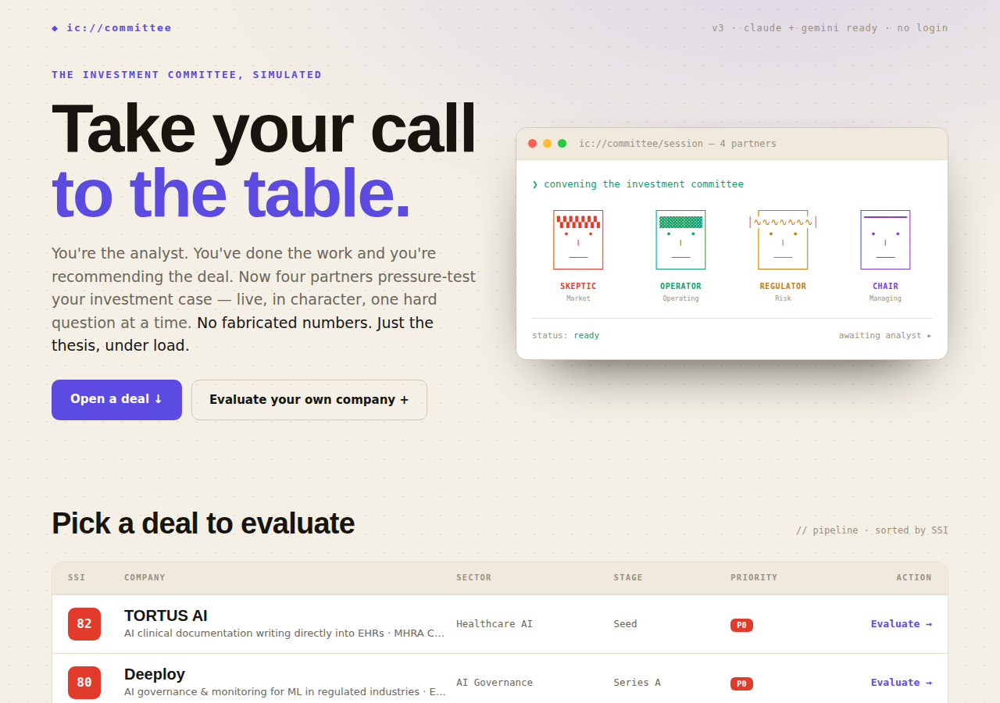

# Adversarial IC — Investment Committee Simulator

A single-file interactive prototype: a VC **investment committee simulator**. You are
the *analyst* recommending a deal, and you defend the investment case — live, in
character — against four AI partners (the **Skeptic**, **Operator**, **Regulator**,
and **Chair**). Analyst POV throughout; never a founder pitch. The committee may only
use the facts in each deal's memo — **no fabricated numbers**.

Imported from the Claude Design project *Adversarial IC Design Concept*.



## What's here

| File | Role |
|---|---|
| `Adversarial IC.dc.html` | The entire app — one Claude **Design Component** (template + a `class Component extends DCLogic` logic block). |
| `support.js` | The Design Component runtime. Loads React/ReactDOM/Babel and mounts the `<x-dc>` component. **Do not edit.** |
| `gemini-provider.js` | Optional model routing (Gemini / OpenAI-compatible / opus-8). Not loaded by default. |
| `CLAUDE.md` | Architecture notes and hard rules for anyone editing the app. |
| `docs/` | Provenance: the original PRD, the day-by-day build prompt, and the visual design doc. |

## Run it

The app is a static `.dc.html` — serve the folder over HTTP and open it. It fetches
React, ReactDOM and Babel from `unpkg.com` at runtime, so an internet connection is
needed on first load.

```bash
# from the repo root
python3 -m http.server 8000
# then open http://localhost:8000/Adversarial%20IC.dc.html
```

Opening the file directly with `file://` will not work — the runtime needs an HTTP
origin to load `./support.js` and the CDN modules.

## Model providers

All model calls route through `_callModel()`, which resolves a provider in this order:

1. **`window.IC_PROVIDER`** — if set, it's used (see `gemini-provider.js` for the
   `createGeminiProvider` / `createOpenAICompatProvider` factories and the
   `ask({ system, messages, maxTokens, useSearch })` contract).
2. **`window.claude.complete`** — the built-in Claude helper (available when the
   component runs inside claude.ai's design runtime). Memo-only, no API key.
3. **Graceful fallback** — if no provider responds, `_fallbackTurn` / `_fallbackReport`
   keep the simulation moving so the UI never dead-ends.

To route the committee through Gemini or a self-hosted gateway, set `window.IC_PROVIDER`
**before** entering the room:

```html
<script type="module">
  import { createGeminiProvider } from './gemini-provider.js';
  window.IC_PROVIDER = createGeminiProvider({
    apiKey: 'YOUR_GEMINI_KEY',
    model:  'gemini-2.5-flash',
    search: false, // set true to allow Google Search grounding (relaxes memo-only)
  });
</script>
```

## Flow

`landing → brief → room → report` (a single `screen` state, each an `<sc-if>` block):

- **Landing** — hero, the four-partner committee, and a deal pipeline table. Pick a
  sample deal or "Evaluate your own company".
- **Brief** — the investment memo: SSI gauge, bento charts (SSI composition, funding,
  comparable rounds), and expandable memo sections.
- **Room** — the live IC. Partners take turns pressuring your case; you respond as the
  analyst. Card view and transcript view render from the same turn array. Sessions
  persist to `localStorage` (`ic_session_v1`) with a Resume/Discard banner on return.
- **Report** — the verdict: a five-dimension score out of 50, each partner's vote, what
  held up, what got exposed. Export via copy-to-clipboard or `.md` download.

See `CLAUDE.md` for the internal architecture (members, deals, the turn loop, judging)
and the rules to preserve when editing.
